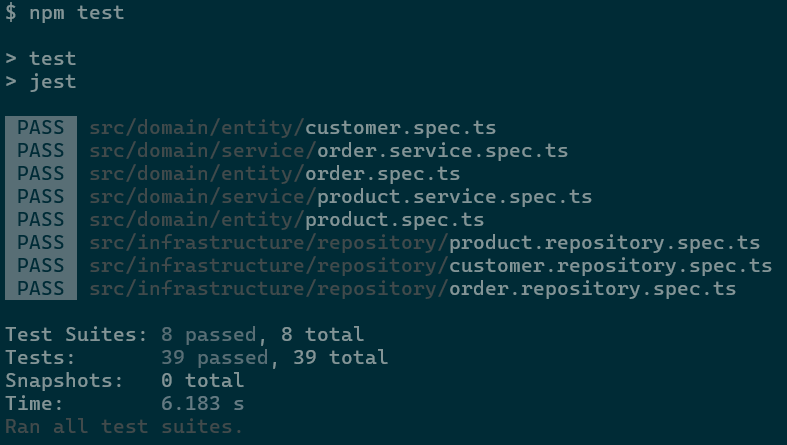

# DDD Order Repository Implementation

## Description
This project is part of the **Full Cycle 3.0** course challenge. The goal is to fully implement the `OrderRepository` class, ensuring it adheres to the `OrderRepositoryInterface`. The implementation must be verified through unit tests, and all tests should pass before submission.

## Challenge Requirements
- Implement the `OrderRepository` class by completing all methods defined in `OrderRepositoryInterface`.
- Ensure that all test cases pass successfully before submission.
- The project is built using **TypeScript** and follows **Domain-Driven Design (DDD)** principles.

## Installation & Setup

###
Cloning the Repository

To get started, clone the repository and navigate to the project directory:
```sh
git clone https://github.com/LuisGaravaso/desafios-fullcycle.git
cd desafios-fullcycle/FC3-DDD-OrderRepository
```

### Prerequisites
Ensure you have the following installed on your machine:
- [Node.js](https://nodejs.org/en/download) (latest LTS version recommended)
- [npm](https://www.npmjs.com/) (included with Node.js)

### Install Dependencies
Run the following command to install the required dependencies:
```sh
npm install
```
After downloading the packages the folder `node_modules` should appear.

## Running Tests
To execute all unit tests, use the following command:
```sh
npm test
```
All tests should pass as follows.



## DDD Concepts
This project follows **Domain-Driven Design (DDD)** principles, structured around key concepts:

### Entity
Entities are objects with a distinct identity that persists over time. They encapsulate core business rules and behaviors. Examples in this project include:
- `Address`
- `Customer`
- `Order`
- `OrderItem` 
- `Product`

### Service
Services encapsulate domain logic that doesn’t naturally fit into an entity. They operate on multiple entities and provide business logic for complex operations. Examples include:
- `OrderService`
- `ProductService`

### Repository
Repositories provide an abstraction layer between domain objects and the persistence mechanism. They handle operations such as storing, retrieving, and updating domain entities. Examples include:
- `CustomerRepository`
- `OrderRepository`
- `ProductRepository`


## Project Structure
The project follows a structured **DDD (Domain-Driven Design)** approach:
```
/src
│── domain/          # Core business logic
│   ├── entity/      # Domain entities (Customer, Order, Product, etc.)
│   │   ├── customer.ts
│   │   ├── order.ts
│   │   ├── product.ts
│   │   ├── order_item.ts
│   │   ├── address.ts
│   │   ├── customer.spec.ts
│   │   ├── order.spec.ts
│   │   ├── product.spec.ts
│   ├── repository/  # Repository interfaces
│   │   ├── repository-interface.ts
│   │   ├── customer-repository-interface.ts
│   │   ├── order-repository-interface.ts
│   │   ├── product-repository-interface.ts
│   ├── service/     # Business logic services
│   │   ├── order.service.ts
│   │   ├── order.service.spec.ts
│   │   ├── product.service.ts
│   │   ├── product.service.spec.ts
│── infrastructure/  # Database and persistence logic
│   ├── db/          # Sequelize database models
│   │   ├── model/
│   │   │   ├── customer.model.ts
│   │   │   ├── order.model.ts
│   │   │   ├── order_item.model.ts
│   │   │   ├── product.model.ts
│   ├── repository/  # Implementations of repository interfaces
│   │   ├── customer.repository.ts
│   │   ├── order.repository.ts
│   │   ├── product.repository.ts
│   │   ├── customer.repository.spec.ts
│   │   ├── order.repository.spec.ts
│   │   ├── product.repository.spec.ts
```

## Database
- This project uses **SQLite** as an in-memory database for testing purposes.
- No additional database setup is required.

## Test Coverage Summary
### `customer.spec.ts`
- Validates the creation of a `Customer`.
- Tests name change functionality.
- Ensures activation and deactivation logic works.
- Validates reward points accumulation.

### `order.spec.ts`
- Ensures order creation requires valid IDs and items.
- Calculates order totals correctly.
- Prevents invalid item quantities and duplicate item IDs.

### `product.spec.ts`
- Validates the creation of a `Product`.
- Allows updating product name and price.

### `customer.repository.spec.ts`
- Tests database operations for `Customer`.
- Ensures customers can be created, updated, found, and retrieved.

### `order.repository.spec.ts`
- Tests database operations for `Order`.
- Allows updating an order’s customer and modifying its items.
- Ensures orders can be created, updated, found, and retrieved.

### `product.repository.spec.ts`
- Tests database operations for `Product`.
- Ensures products can be created, updated, found, and retrieved.

### `order.service.spec.ts`
- Calculates the total of all orders.
- Places an order and updates customer reward points.

### `product.service.spec.ts`
- Increases the price of all products by a given percentage.

