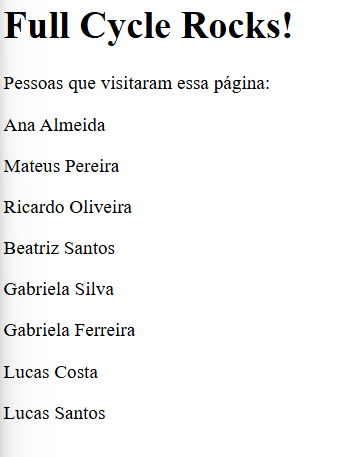

# Full Cycle 3.0 - Docker, Nginx, Node.js, and MySQL Challenge

This project demonstrates the integration of **Nginx** as a reverse proxy, **Node.js** for backend logic, and **MySQL** as the database. It fulfills the requirements of the Full Cycle 3.0 challenge to create a system that dynamically adds and lists names from a database, with everything running seamlessly using **Docker Compose**.

---

## **How It Works**

1. **Nginx** acts as a reverse proxy, forwarding requests to the Node.js application.
2. The **Node.js application**:
   - Adds a new randomly generated name to the `people` table in the MySQL database.
   - Retrieves all registered names from the database.
   - Returns an HTML response containing:
     - A header: `<h1>Full Cycle Rocks!</h1>`
     - A list of all registered names.
3. The **MySQL database** stores the names in the `people` table.

---

## **Requirements**

- Docker and Docker Compose installed on your system.

---

## **Setup Instructions**

**1. Clone the repository**:
   ```bash
   git clone https://github.com/LuisGaravaso/desafios-fullcycle.git
   cd desafios-fullcycle/FC3-Docker-NodeNginx
   ```

**2. Start the services:**
   ```bash
   docker-compose up -d
   ```

**3. Access the application in your browser at:**
   ```
   http://localhost:8080
   ```

**4. Note it might take a while to build the MySQL database**

   If you access http://localhost:8080 and get "Internal Server Error", wait a few seconds and reload the page.
   That happens because the MySQL database is still setting up

**5. Everytime you Refresh the page, a new person will be displayed and added to the database**

Once the server is working properly, you should see a page like this:



**Note that the names you see can be different due to the random names generator.**

---

## **Folder Structure**

```
.
├── docker-compose.yaml   # Orchestrates all services
├── backend/              # Node.js application
│   ├── Dockerfile        # Docker configuration for the backend
│   ├── index.js          # Main Node.js application file
│   ├── package.json      # Node.js dependencies and scripts
├── nginx/                # Nginx configuration
│   ├── default.conf      # Reverse proxy settings for Nginx
├── mysql/                # MySQL configuration and initialization
│   ├── init.sql          # SQL script to initialize the database
```

---

## **Services**

1. **Nginx**:
   - Listens on port `8080`.
   - Proxies requests to the Node.js backend.

2. **Node.js Backend**:
   - Listens internally on port `9000`.
   - Handles requests to add and retrieve names from the database.

3. **MySQL Database**:
   - Runs on the default MySQL port `3306`.
   - Stores the `people` table.

---

## **MySQL Database Schema**

The database table is created with the following structure:
```sql
CREATE TABLE people (
    id VARCHAR(36) NOT NULL,
    name VARCHAR(255) NOT NULL,
    PRIMARY KEY (id)
);
```

---

## **Stopping the Application**

To stop all services, run:
```bash
docker-compose down
```

---

## **Challenge Requirements Fulfilled**

1. **Nginx as Reverse Proxy**:  
   - All requests to `http://localhost:8080` are forwarded to the Node.js application.

2. **Node.js Backend**:
   - Inserts a random name into the MySQL database.
   - Retrieves all names and returns them in the HTML response.

3. **Dockerized Setup**:
   - Fully containerized with `docker-compose up -d`.
   - Development mode enabled with backend source code mounted as a volume.

4. **Accessible on Port 8080**:
   - Application is available at `http://localhost:8080`.

---

## **Accessing Logs**

For troubleshooting, you can view logs for any service:
```bash
# View Nginx logs
docker-compose logs -f nginx

# View Node.js backend logs
docker-compose logs -f backend

# View MySQL logs
docker-compose logs -f db
```

---

## **License**

This project was created as part of the **Full Cycle 3.0** course. Feel free to use and modify it as needed!