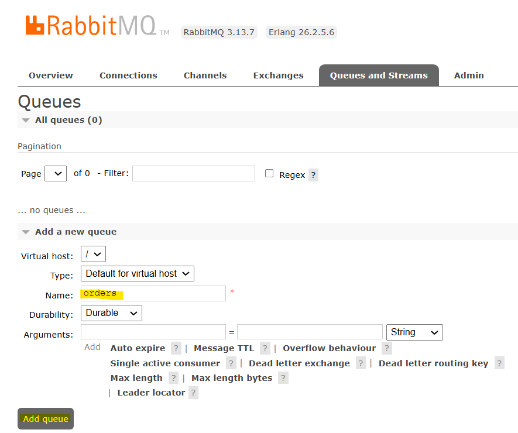
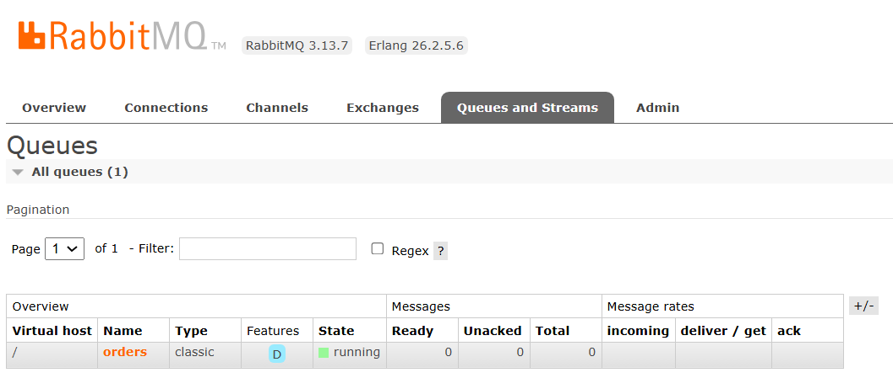
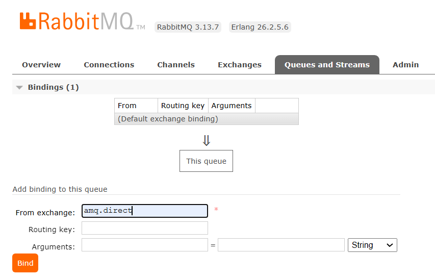
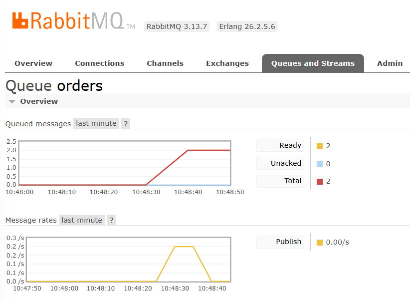

# Setting Up RabbitMQ

This guide will help you configure RabbitMQ to work with the Clean Architecture Project. Follow these steps:

## First Step

After logging into the RabbitMQ Management Dashboard:

1. Go to **Queues** and **Streams**.
2. Create a new queue.
   - **Name**: `orders`
   - Click on **Add Queue**.

---

## Second Step

1. Click on the **orders** queue you just created.

---

## Third Step

1. Scroll down to the **Bindings** section.
2. In the **From exchange** field, type: `amq.direct`.
3. Bind the queue to the exchange.

---

## Fourth Step

Once you start communicating with the application via **gRPC**, **GraphQL**, or **REST**, you will see messages appearing in the RabbitMQ dashboard.

---

Your RabbitMQ setup is now complete and ready to handle messages from the application.

